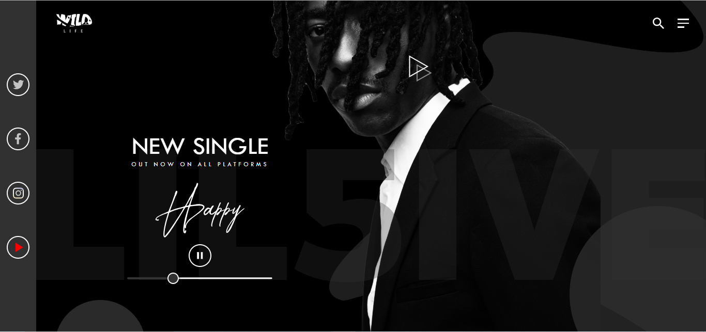
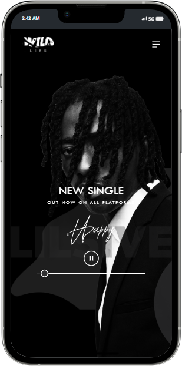
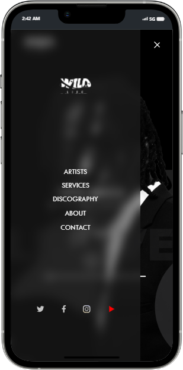

# Wild Life Player

Wild Life Player: This project is a brief test on a custom music player for new single songs released by your favourite artists.

## Getting Started

Clone or download this repository and run with a local server of open `localhost:5173/` with your favorite browser

## Prequisite

- Your browser version must be recent for a better experience.

## Features

- Home Page

## Tech/framework used

- HTML
- CSS
- ReactJS
- Vite
- Tailwind-CSS
- TypeScript
- React-Icons

## Package Manager
- NPM

## Preview

[Preview Here](https://wild-player.vercel.app/)

## Display on both Laptop and Mobile Phone

## Contact

If you want to contact me you can reach me at
Email - wolabash@gmail.com 
Github- https://github.com/PrimeFord

